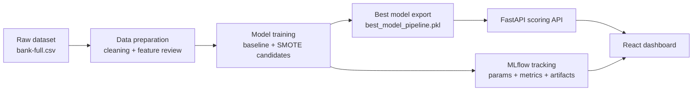

# Bank Marketing Subscription Intelligence Platform

An end-to-end machine learning, BI, and MLOps solution for bank subscription prediction, featuring robust data preparation, leakage-aware modeling, experiment tracking with MLflow, REST API deployment with FastAPI, and a business-focused React interface for scoring and campaign analysis.

## Highlights

- End-to-end ML workflow from raw banking data to deployed prediction service
- Leakage-aware feature selection with `duration` excluded from production scoring
- MLflow experiment tracking for runs, metrics, parameters, artifacts, and model governance
- FastAPI backend for single prediction, batch scoring, and scenario simulation
- Business-oriented React dashboard with explainability and paginated batch review
- Dockerized backend, frontend, and MLflow services for reproducible local deployment

## Suggested GitHub Topics

`machine-learning` `mlops` `fastapi` `react` `mlflow` `xgboost` `scikit-learn` `business-intelligence` `bank-marketing` `docker`

## Architecture



## Project Objective

The objective is to support bank campaign planning with a realistic `pre-contact` prediction system.

Instead of using variables that are only known after a call has finished, the production pipeline focuses on features available before or during campaign planning. This makes the results more credible for business use and more defensible in an academic setting.

## Business Problem

Banks invest time and money in outbound marketing campaigns. Not every client should receive the same level of effort. This project helps answer:

- Which customers are most likely to subscribe to a term deposit?
- Which customer segments offer the best campaign opportunity?
- Which operational levers can improve conversion probability?
- How can we track, compare, and deploy models in a professional workflow?

## Key Academic Strengths

- End-to-end ML workflow from raw data to deployed API
- Explicit data preparation pipeline, not just model training
- Feature selection justified with leakage review and target association analysis
- Standardization and encoding handled inside the training pipeline
- Comparison of linear and non-linear models
- MLflow experiment tracking and model governance
- Professional dashboard for BI storytelling and demonstration

## Dataset

The dataset comes from the classic bank marketing use case and includes customer profile, financial context, and campaign history variables.

Target variable:
- `y`: whether the client subscribed to the term deposit

Production modeling scope:
- `pre-contact` / campaign-planning prediction

Important methodological decision:
- `duration` is excluded from the production model because it is a post-call variable and creates target leakage

## Data Preparation

Data preparation is a central part of this project and is implemented in [code/data_preparation.py](code/data_preparation.py).

### What the preparation pipeline does

- loads the raw dataset
- cleans column names and string values
- removes duplicate rows
- keeps only the selected production features plus the target
- generates a feature analysis report
- saves a cleaned modeling dataset
- saves a JSON summary of the preparation decisions

### Preprocessing strategy

Numeric features:
- median imputation
- standardization with `StandardScaler`

Categorical features:
- most-frequent imputation
- one-hot encoding with `OneHotEncoder`

Why standardization is used:
- it is important for linear models such as logistic regression
- it keeps the preparation step academically complete and methodologically clear
- it is applied inside the pipeline, which avoids data leakage

Why global normalization is not used:
- tree-based models do not require min-max normalization
- standardization is enough for the numeric preprocessing step in this project

### Feature selection and justification

The project now produces:

- [data/feature_analysis_report.csv](data/feature_analysis_report.csv)
- [data/data_preparation_summary.json](data/data_preparation_summary.json)

Each feature is reviewed using:

- variable type
- missing rate
- target association
- leakage risk
- preprocessing method
- modeling decision

Current logic:

- `duration`: removed, high leakage risk
- `day`, `month`, `campaign`: kept with monitoring because they depend on the prediction moment
- `pdays`, `previous`, `poutcome`: kept because they describe prior client history

## Modeling

Training is implemented in [code/modeling.py](code/modeling.py).

### Models compared

- `LogisticRegression_Baseline`
- `GradientBoosting_SMOTE`
- `RandomForest_Baseline`
- `XGBoost_SMOTE`

### Modeling strategy

- stratified train/test split
- preprocessing included in the pipeline
- true baseline models trained without SMOTE
- SMOTE used only for the explicitly oversampled candidates
- `GridSearchCV` for hyperparameter tuning
- evaluation with `accuracy`, `f1`, and `roc_auc`
- confusion matrix and ROC curve exported for each model

### Current tracked result

The current champion model can change after each training run and is always exported to:

- [data/model_metrics.csv](data/model_metrics.csv)
- [data/best_model_pipeline.pkl](data/best_model_pipeline.pkl)

Why this is important:
- the best model is selected after removing the leaking variable `duration`
- the score is lower than the leaked version, but much more realistic and academically valid

## MLflow Tracking

MLflow is used for experiment tracking, model comparison, and governance.

Tracked elements include:

- runs by model
- parameters
- metrics
- artifacts
- saved model
- preparation metadata such as selected feature set and excluded variables

Default storage:

- backend store: `mlflow.db`
- artifacts: `mlartifacts/`

## API

The backend is built with FastAPI in [code/app.py](code/app.py).

### Main endpoints

- `GET /health`
- `GET /dashboard/overview`
- `GET /dashboard/explainability`
- `GET /dashboard/data-preparation`
- `POST /predict`
- `POST /predict/what-if`
- `POST /predict_batch`

### API roles

- single customer scoring
- scenario simulation
- batch portfolio scoring
- dashboard data delivery
- feature preparation and governance visibility

Batch scoring notes:

- accepts comma-separated and semicolon-separated CSV files
- tolerates legacy columns such as `duration` and `y` by dropping them before scoring

Swagger UI:
- [http://127.0.0.1:8000/docs](http://127.0.0.1:8000/docs)

ReDoc:
- [http://127.0.0.1:8000/redoc](http://127.0.0.1:8000/redoc)

## Frontend Dashboard

The frontend is built with React and Vite in [frontend/src/App.jsx](frontend/src/App.jsx).

The dashboard is now business-oriented and includes:

- executive KPI strip for portfolio size, conversion baseline, balance, and campaign pressure
- portfolio opportunities panel for high-conversion customer segments
- campaign actions panel driven by explainability-based business levers
- customer scoring workspace for individual lead evaluation
- decision summary with probability, propensity band, and next action
- scenario planner for controllable outreach adjustments
- model drivers view for top production features
- batch scoring workspace with page navigation and configurable page size

## Project Structure

```text
bank-subscription-mlops-main/
|-- code/
|   |-- app.py
|   |-- data_exploration.py
|   |-- data_preparation.py
|   |-- mlflow_utils.py
|   |-- modeling.py
|   `-- settings.py
|-- data/
|   |-- bank-full.csv
|   |-- bank-full-clean.csv
|   |-- best_model_pipeline.pkl
|   |-- model_metrics.csv
|   |-- feature_analysis_report.csv
|   `-- data_preparation_summary.json
|-- frontend/
|-- mlartifacts/
|-- docker-compose.yml
|-- Dockerfile
|-- mlflow.db
`-- requirements.txt
```

## Local Installation

### 1. Create and activate the environment

```bash
python -m venv .venv
```

Windows:

```bash
.venv\Scripts\activate
```

### 2. Install dependencies

```bash
pip install -r requirements.txt
```

### 3. Install frontend dependencies

```bash
cd frontend
npm install
cd ..
```

## Run the Project Locally

### 1. Prepare the data

```bash
python code/data_preparation.py
```

### 2. Train the models

```bash
python code/modeling.py
```

### 3. Start the API

```bash
uvicorn app:app --app-dir code --host 127.0.0.1 --port 8000
```

### 4. Start MLflow

```bash
mlflow server --backend-store-uri sqlite:///mlflow.db --default-artifact-root file:./mlartifacts --serve-artifacts --host 127.0.0.1 --port 5000
```

### 5. Start the frontend

```bash
cd frontend
npm run dev
```

### Local access

- Frontend: [http://127.0.0.1:5173](http://127.0.0.1:5173)
- API: [http://127.0.0.1:8000](http://127.0.0.1:8000)
- MLflow: [http://127.0.0.1:5000](http://127.0.0.1:5000)

Optional frontend environment variables:

- `VITE_API_BASE_URL` to point the UI to a different backend
- `VITE_MLFLOW_UI_URL` to point the UI to a different MLflow server

## Run with Docker

```bash
docker compose up --build
```

Docker access:

- Frontend: [http://localhost:3000](http://localhost:3000)
- API: [http://localhost:8000](http://localhost:8000)
- MLflow: [http://localhost:5000](http://localhost:5000)

## Why This Project Is Defensible in a Presentation

- It does not rely on a leaking feature for the main production score.
- It shows that preprocessing decisions are explicit and reproducible.
- It compares true baseline models against oversampled alternatives instead of presenting one result without context.
- It exposes data preparation, feature decisions, and model governance in the dashboard.
- It links machine learning outputs to business actions and BI storytelling.

## Next Possible Improvements

- add a stricter `pure pre-campaign` model without `day`, `month`, and `campaign`
- add SHAP-based local explanations
- export a PDF report for professor presentation
- add model registry states such as champion/challenger
- add automated data quality checks before batch scoring

## Author Note

This repository has been adapted into a professional academic MLOps case study focused on realistic bank subscription prediction, data preparation rigor, and presentation quality.
